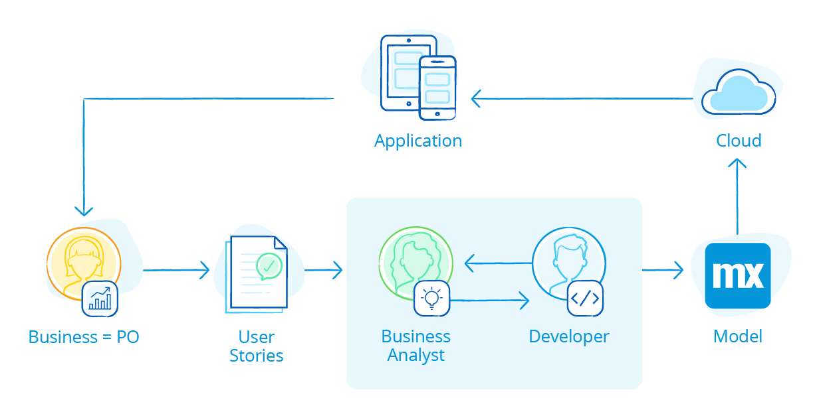

## 1 What Development Process Works Best for Mendix? {#bizdevops}

The app development process that Mendix uses since the first day it was founded are later labelled as a combination of Agile and DevOps, though optimized for low-code app development. Due the high focus on business and IT collaboration the Mendix Development process can be better described as **BizDevOps** or **DevOps 2.0**. Mendix has optimized the BizDevOps approach for low-code usage. 

The Mendix Development process encourages developers, operations staff, and business teams to work together so the organization can develop software more quickly, be more responsive to user demand, and ultimately maximize revenue. In this approach, not only does the business team set the requirements, they also work directly with the development team. The development team exists out of business analyst and professional developers working along side with the business. 

This section explains the concept of the Mendix Development process (BizDevOps) and compares this with other software development processes.

## 2 Why Should I Use a BizDevOps Process?

Adopting the Mendix Development process (BizDevOps) in combination with the Mendix low-code development platfrom shortens the feedback loop drastically, which increases the efficiency - resulting in better outcomes, lower the costs of app developerment and shortens the time to market. 

In Mendix app development projects there is an instant feedback loop, within the development team, between the business analysts and the developers. Due the Mendix platform capabilities as one-click-deployment and visual modeling the development team can handle an hourly feedback loop from the business / product owner. It's often now the business which determines the duration of the feedback loop. In practice this results in a feedback loop of one to two weeks the business and the development team and monthly releases. 

Just like Agile reduced the time to market significantly with roughly 50% by implementing shorter feedback loops, we see even better results by the Mendix approach compared to agile. The BizDevOps approach not only reduced the time to market with another 50%, it also reduces the development effort with another 70%.

## 3 How does Mendix support a BizDevOps Process?

Mendix has optimized the BizDevOps approach for the use of low-code, resulting in a feedback loop of less then a month. On a high level, the short feedback loop is ensured due to four factors of the Mendix Platform:

* **[Integrated requirement management](app-lifecycle/requirements-overview)** – The business provide their requirements and feedback on the live app (minimal viable product) through a user friendly feedback mechanism, which is integrated in the Mendix IDE's. This provides developers with contextual metadata, such as page, user, browser, etc.
* **[Visual modeling](app-lifecycle/developing-in-mendix)** – With the Mendix low-code platform, the business analysts is enabled to visually build apps and work together with the professional developer's work on a common model, in a shared environment with ongoing real-time feedback. Any issues are quickly detected and resolved ensuring apps meet business and customer expectations with the first release.
* **[Team synergy](app-lifecycle/app-development) by providing multiple IDE's (modelers)** – With tailored made IDE's for the different roles, we enable everyone to contribute to their strenghts, while still working on the same model.
* **[One-click deployment](app-capabilities/multi-cloud-overview)** – The one-click deployment to any cloud ensures that the app can be released in minutes, enabling the business to provide their feedback on the next iteration.

## 4 What are the key roles in the a Mendix developer team? {#changing-roles}

The core development team in Mendix low-code BizDevOps projects consists out of three main roles; the business user or representative, the business analyst and the developer.

The **business representative** has a key role in the BizDevOps process. The business user is, as a product owner, responsible for providing the input from the business in requirements or feedback on the app, and translating them into user stories.

The **business analyst** (who talks to the business) works together with a more technical developer to run the entire application delivery lifecycle, including the operations. The enablement of the business analyst is key in interpreting the requirements and feedback from the business correctly. In other words, they speak the same language to verify the UX/UI (pages), business rules (logic) and the conceptual data model. 

The **developer** is key to and deliver tangible results by supporting the business analyst to build the apps with focussing on the technical work as the integrations, data model, security, performace, etc.

This core development team runs the entire application delivery lifecycle without the direct help of a Java programmer, . All these roles are still important, especially in an enterprise-scale delivery of multiple applications. However, they are part of a higher level Center of Excellence, wis often spread between multiple Mendix application development teams.

The other roles, such as UX/UI expert and test engineer are involved too as enablers and specialists (fly-in experts) in the project.

## 5 How Does Mendix Fit into Agile?

The Agile methodology is adopted in the DevOps approach. The Agile methodology changed traditional Waterfall projects from a linear approach to an iterative, team-based approach to software development. This approach emphasizes the rapid delivery of an application in complete functional components per “time-boxed” phases called sprints. Each sprint has a defined duration with a running list of deliverables, planned at the start of the sprint. The Agile approach enables the business to review a minimal viable product (MVP), which is a product with just enough features to satisfy and enable the business to provide feedback for future development.  

Mendix enables development teams to adopt an Agile approach based on Scrum in which they collaborate closely with internal and external stakeholders in short iterative development cycles. With capabilities as sprint and story management and integrated feedback management via embedded feedback widgets that enable end-users to provide instant feedback directly within an application. The closed feedback loop enables the development team to quickly resolve queries from the business, facilitating rapid iteration as emphasized in the Agile methodology. Read this section if you would like to learn more about how [Mendix supports Agile Requirements Management](app-lifecycle/requirements-management).

## 6 How Does Mendix Fit into DevOps?

DevOps is a software engineering culture and practice that aims at unifying software development (Dev) and software operation (Ops). The main characteristic of the DevOps movement is to strongly advocate automation and monitoring at all steps of software construction, from integration, testing, releasing to deployment and infrastructure management. DevOps aims at shorter development cycles, increased deployment frequency, and more dependable releases, in close alignment with business objectives.

Mendix provides DevOps tools out of the box for CI/CD, test automation, and monitoring, among other services, enabling your development teams to embrace the DevOps way of working. Read [this section](app-lifecycle/devops) to learn more about how Mendix supports DevOps. 

Compared to DevOps, the BizDevOps approach knocks down the silos between the DevOps teams (meaning, the development teams and operations staff) and the business teams.  

## 7 How Does Mendix Fit into Traditional App Development?

In Traditional App Development feedback can only be given on full working applications, instead of iterative approach in the Agile methodology. Compared to DevOps the teams, Traditional app development projects, development teams, operation teams, and business management teams all operated in silos instead of unifying software development (Dev) and software operation (Ops).

In a Traditional App Development process Mendix can be used as a low-code development platform to enable the developers to build apps faster, and operations can use the Mendix Cloud Portal to manage and monitor their. Of course in this approach you will miss a big part what makes building apps with Mendix so succesfull; The Mendix development process.
